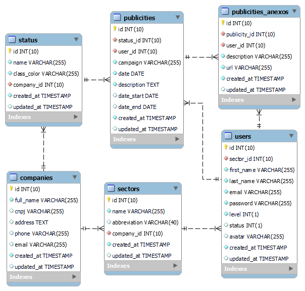

# SIGZUM - Sistema de Gestão da Zum Telecom.

Este projeto tem como objetivo ajudar na automatização de padronização de tarefas rotineiras realizadas na empresa.

## Versão 1.0

- Modulo 01 - Controle de Marketing & Gestão de Usuários

### Tecnologias Utilizadas:

`HTML 5` `CSS 3` `JavaScript` `jQuery` `PHP 8.2.^` `MySQL` `MVC`

### Copyright 2024

Desenvolvedor: <b>Joab T. Alencar</b> 
Website: <a href="https//www.joabtorres.com.br">joabtorres.com.br</a>

## SETUP

1º [OPCIONAL] Atualizar as dependências do composer no terminal `composer update`;

2º Crie um banco de dados MySQL e import o arquivo `sigzum_db.sql`;

3º Acesse o arquivo Config.php em `source/Boot/Config.php`;

4º Configure as constantes;

/\*_
DATABASE
_/

define("CONF_DB_HOST", "localhost");

define("CONF_DB_USER", "NOME_DO_USUARIO");

define("CONF_DB_PASS", "SENHA_DO_BANCO");

define("CONF_DB_NAME", "NOME_DO_BANCO");

/\*_
PROJECT URLs
_/

define("CONF_URL_BASE", "DOMINIO DO SITE");

/\*_
MAIL
(necessário ter uma conta no sendgrid.net)
_/

define("CONF_MAIL_PASS", "");

define("CONF_MAIL_SENDER", ["name" => "", "address" => ""]);

define("CONF_MAIL_SUPPORT", "");

define("CONF_MAIL_DESTINATARY", "");

## Diretórios

`\_documentacao` documentação do projto

`\shared`

-- `\shared\fontawesome`

-- `\shared\css`

-- `\shared\js`

-- `\shared\webfonts` fonts do plugin fontawesome

-- `\shared\views` views externas da aplicação

--- `\shared\views\email`

`\source` core da aplicação

-- `\source\App` controlles

-- `\source\Boot` configurações

-- `\source\Core` core

-- `\source\Models` models

-- `\source\Models\Publicity` models

-- `\source\Support` classes externas

`\storage` diretório de upload

-- `\storage\media`

-- `\storage\files`

-- `\storage\images`

-- `\storage\cache`

`\themes` views da aplicação

-- `\themes\sigzum` view

--- `\themes\sigzum\assets`

---- `\themes\sigzum\assets\css` css

---- `\themes\sigzum\assets\js` js

---- `\themes\sigzum\assets\images` imagens

--- `\themes\sigzum\auth` views da sessão delogin

--- `\themes\sigzum\publicity` views da sessão de campanhas

---- `\themes\sigzum\publicity\anexos`views da sessão de anexos das campanhas

--- `\themes\sigzum\sector` views da sessão do setor

--- `\themes\sigzum\status` views da sessão de status

--- `\themes\sigzum\user` views da sessão de usuario

`\vendor` composer

## Banco de Dados

Versão 1.0, 21 de março de 2024.

## Rotas

Todas as rotas estão no arquivos `index.php`, localizado na pasta raiz do projeto.

- Home

       $route->namespace("Source\App");
       $route->get("/", "HomeController@home");

- Auth (login)

       $route->group(null);
       $route->get("/login", "AuthController@login");
       $route->post("/login", "AuthController@login");
       $route->get("/logout", "AuthController@logout");
       $route->get("/forget", "AuthController@forget");
       $route->post("/forget", "AuthController@forget");
       $route->get("/forget/{code}", "AuthController@reset");
       $route->post("/forget/reset", "AuthController@reset");

- Empresa (Company)

        $route->group("/company");
        $route->get("", "CompanyController@search");
        $route->post("", "CompanyController@search");
        $route->get("/{type}/{search}/{date_start}/{date_final}/{order}/{page}", "CompanyController@search");
        $route->post("/register", "CompanyController@register");
        $route->get("/update/{company}", "CompanyController@update");
        $route->post("/update/{company}", "CompanyController@update");
        $route->get("/remove/{company}", "CompanyController@remove");

- Setores (Sectors)

       $route->group("/sector");
       $route->get("", "SectorController@search");
       $route->post("", "SectorController@search");
       $route->get("/{type}/{search}/{date_start}/{date_final}/{order}/{page}", "SectorController@search");
       $route->post("/register", "SectorController@register");
       $route->get("/update/{id}", "SectorController@update");
       $route->post("/update/{id}", "SectorController@update");
       $route->get("/remove/{id}", "SectorController@remove");

- Status (Status)

        $route->group("/status");
        $route->get("", "StatusController@search");
        $route->post("", "StatusController@search");
        $route->get("/{type}/{search}/{date_start}/{date_final}/{order}/{page}", "StatusController@search");
        $route->post("/register", "StatusController@register");
        $route->get("/update/{id}", "StatusController@update");
        $route->post("/update/{id}", "StatusController@update");
        $route->get("/remove/{id}", "StatusController@remove");

- Usuários (Users)

        $route->group("/user");
        $route->get("", "UserController@search");
        $route->post("", "UserController@search");
        $route->get("/{type}/{search}/{date_start}/{date_final}/{order}/{page}", "UserController@search");
        $route->get("/register", "UserController@register");
        $route->post("/register", "UserController@register");
        $route->get("/update/{id}", "UserController@update");
        $route->post("/update/{id}", "UserController@update");
        $route->get("/remove/{id}", "UserController@remove");

- Campanhas Publicitárias (Publicities)

        $route->group("/publicity");
        $route->get("", "PublicityController@search");
        $route->post("", "PublicityController@search");
        $route->get("/{status}/{type}/{search}/{date_start}/{date_final}/{order}/{page}", "PublicityController@search");
        $route->get("/register", "PublicityController@register");
        $route->get("/view/{id}", "PublicityController@view");
        $route->post("/register", "PublicityController@register");
        $route->get("/update/{id}", "PublicityController@update");
        $route->post("/update/{id}", "PublicityController@update");
        $route->get("/remove/{id}", "PublicityController@remove");
        $route->get("/graphic", "PublicityController@graphic");

- Upload de arquivos da campanha publicitária (Anexos)

        $route->post("/anexo/register", "PublicityController@registerAnexo");
        $route->get("/anexo/remove/{id}", "PublicityController@removeAnexo");

- ERROR ROUTES [400, 404,405, 501]

       $route->namespace("Source\App")->group("/ops");
       $route->get("/{errcode}", "ErrorController@error");

